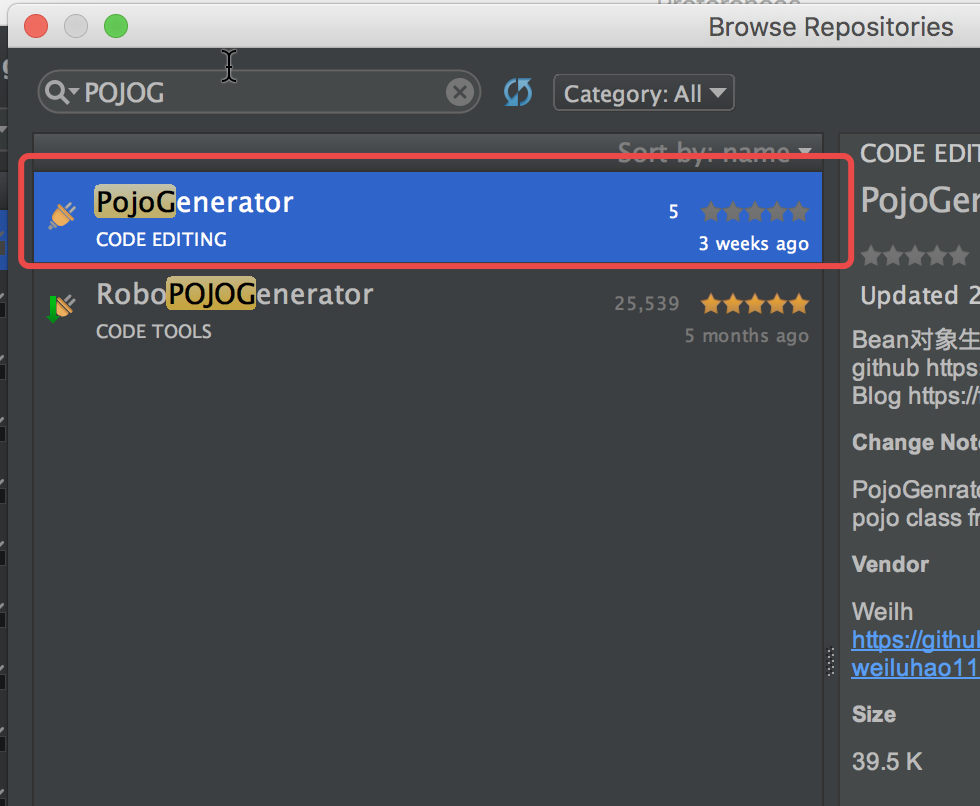

# PojoGenerator
[Engilish](./READEME.md)   

PojoGenerator 是一个idea(Android Studio)插件，用来将一些格式化的文本内容转换成Java的Pojo对象。  
你可以通过制定lineSplit 和 blockSplit 来制定，行和块之间的分割符号。  
其中一行会被解析为一个字段模块，block会被解析为字段的某个属性（名称 类型 描述等）。  
你可以通过namePosition typePosition descripPosition来指定各个模块的含义。计数从1开始。

## DOWNLOAD



## HOW TO USE  
在要生成Java POJO的package上右键 -> New -> PojoGenerator 打开配置页面。  
将文本粘贴到文本区域后，配置相关的配置项点击OK即可。
Name Position : 名字的位置
Type Position : 类型的位置  
Describe Position : 描述位置  
class Name : 生成的类名  
lineSplit : 行分割符  
blockSplit : 块分隔符

你还可以选择强行将 下划线转换为驼峰，或强制将首字母小写

如下图所示：
  
  

将生成java对象：  

```java
public class Test {
    /**
     * 测试整形
     */
    public int testInt;
    /**
     * 测试字符串
     */
    public String testStr;
    /**
     * 测试Long
     */
    public long testLong;
}
```
