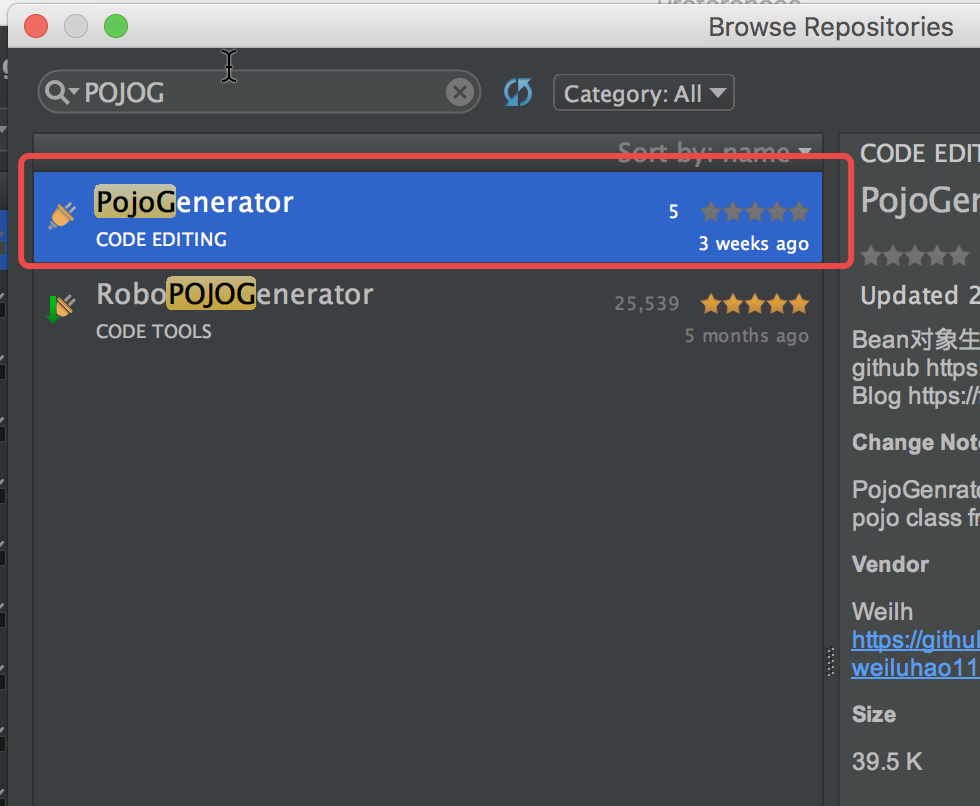
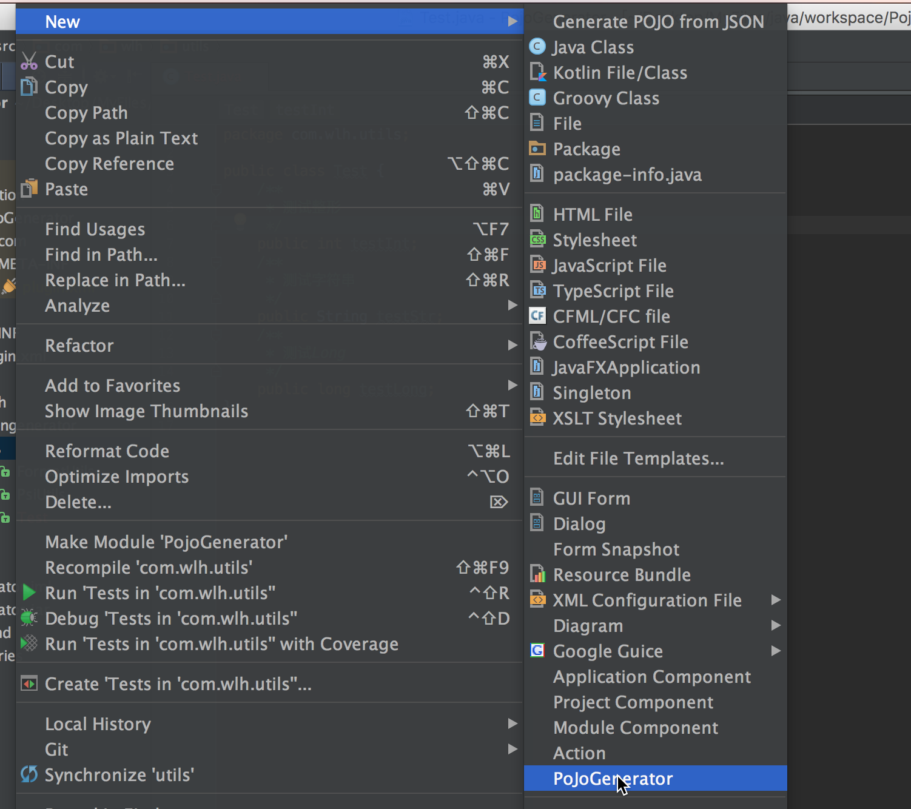
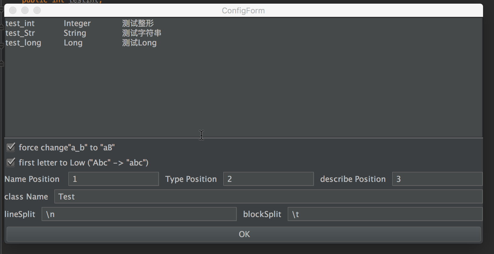

# PojoGenerator
[中文说明](./READEME-CH.md)  

PojoGenrator is a plugin for idea (Android Studio),what can generator pojo class from format text  

you can set the "lineSplit" and "blockSplit" to decide how to split the content.  
you can set the position of name to decide what is the name string and so on.
## DOWNLOAD



## HOW TO USE  
copy the format text to the TextArea, then choose the options and click button.  
Name Position : the index of Name Str  
Type Position : the index of Type Str  
Describe Position : the index of Describe Str  
class Name : the name of class what will be generated  
lineSplit : line split str  
blockSplit : block split str
there are some other options what is easy to understand.  

this is a picture of UI
  
  

what is generated : 

```java
public class Test {
    /**
     * 测试整形
     */
    public int testInt;
    /**
     * 测试字符串
     */
    public String testStr;
    /**
     * 测试Long
     */
    public long testLong;
}
```
